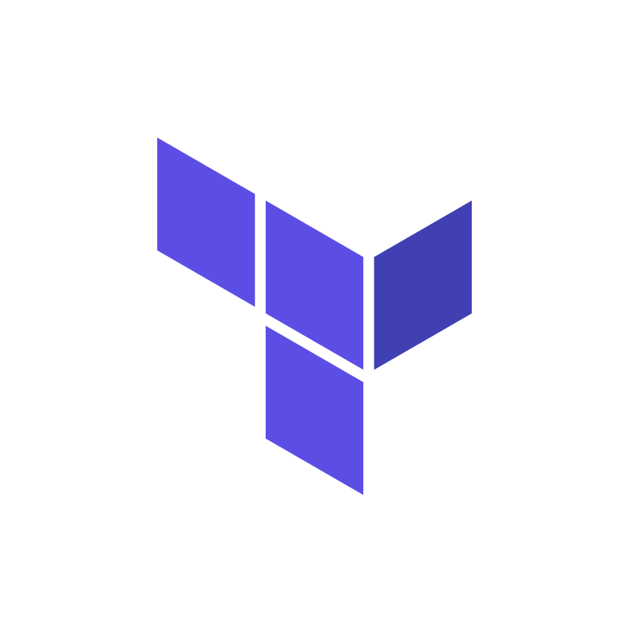

### ☝ Hi my name is Jonatan Lima, but my friends call me Balu.

I specialize in backend development using Node.js, Docker, Kubernetes (k8s), RabbitMQ, AWS services, Terraform, MongoDB, PostgreSQL, and other leading technologies, while also exploring C, Rust, Go (Golang), and Lua.

I'm interested in designing large-scale systems architecture, building microservices, creating bots, automating tasks, and ensuring robust observability.

I follow proven methodologies like TDD (Test-Driven Development), DDD (Domain-Driven Design), BDD (Behavior-Driven Development), Ports and Adapters Architecture, and principles of Clean Architecture.

- Senior Backend Developer at [Delivery Much Brasil](https://www.deliverymuch.com.br).
- Writer in [dev.to](https://dev.to/jonatanlima).
- My talk about [Node.js Design Patterns](https://youtu.be/AWISf1mNcso?feature=shared).

## 📫 Contact Information

- [Email](mailto:jotanlima@gmail.com)
- [Linkedin](https://www.linkedin.com/in/jonatan-lima-977416102)

<h2 align="left">Languages and Tools</h3>

  
  
  
  <!--  -->
  <!--  -->
  
  
  
  
  
  
  
  
  
  
  
  

<!--
## 🔥 My Stats

 

       

-->
